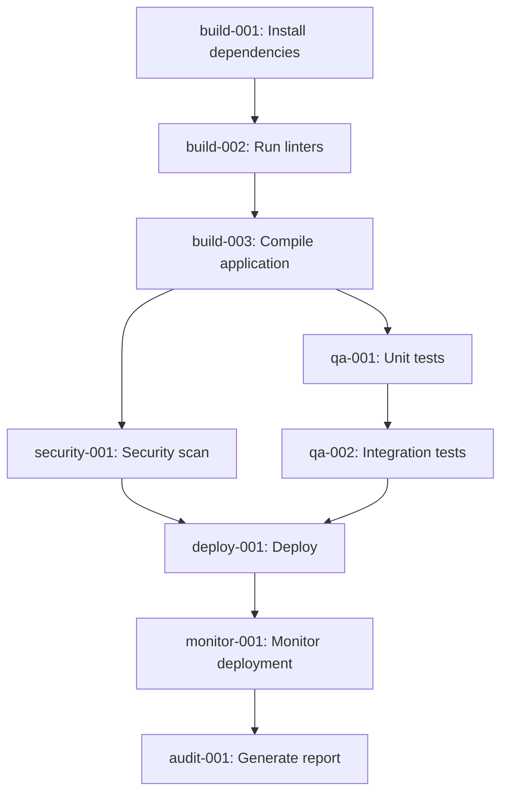

# 🚀 T-Max Work3 Full-Auto Pipeline Orchestrator

ClaudeCode × T-Max Work3 による**完全自動システム構築・検証・修正・デプロイ・監視パイプライン**

## 📊 概要

T-Max Work3は、**git worktree + tmux + Blackboard Architecture**を活用した完全自動化CI/CDパイプラインです。

Coordinator Agentが全工程を統括し、エラー修正・再テスト・デプロイ完了までを**人手介入なし**で実行します。

---

## 🏗️ アーキテクチャ

```
┌────────────────────────────────────────────────────────┐
│                  Coordinator Agent                     │
│           (全体統括・タスク分解・再割当)                 │
└───────────┬────────────────────────────────┬───────────┘
            │                                │
     ┌──────┴──────┐                 ┌──────┴──────┐
     │  Blackboard │ ←──────────────→│   tmux      │
     │  (共有状態)  │                 │  (5 windows)│
     └──────┬──────┘                 └──────┬──────┘
            │                                │
    ┌───────┴────────────────────────────────┴───────┐
    │                                                 │
┌───▼───┐  ┌────▼────┐  ┌─────▼─────┐  ┌──────▼──────┐
│Builder│  │   QA    │  │  Security  │  │  Performance│
│Agent  │  │  Agent  │  │   Agent    │  │   Agent     │
└───┬───┘  └────┬────┘  └─────┬─────┘  └──────┬──────┘
    │           │              │                │
┌───▼──────────▼──────────────▼────────────────▼───┐
│               Git Worktrees                      │
│   build_env / qa_env / deploy_env / monitor_env  │
└──────────────────────────────────────────────────┘
```

---

## ✨ 主な機能

### 1. **Blackboard Architecture**
- 全エージェントが状態を共有する中央集権的なメッセージボード
- タスクDAG、エージェント状態、ログ、メトリクスを一元管理
- スレッドセーフな読み書き

### 2. **Git Worktree 分離**
- 各処理段階（build/qa/deploy/monitor）を独立環境として生成
- 並列実行時の競合を完全回避
- ブランチ切り替え不要

### 3. **tmux Multi-Window**
- 5つのtmuxウィンドウで各エージェントを並列常駐
- リアルタイムで各エージェントの動作を監視可能
- `tmux attach -t TMAX_FULLAUTO` で全画面確認

### 4. **自動リカバリ**
- 失敗タスクを自動検出し、最大3回まで再試行
- エラー原因をBlackboardに記録
- 依存関係を考慮した再割当

### 5. **完全自動化**
- 依存関係解決（タスクDAG）
- ビルド → テスト → セキュリティ → デプロイ → 監視
- 全工程が自動実行

---

## 🚦 使い方

### クイックスタート

```bash
# 1. T-Max Work3ディレクトリに移動
cd tmax_work3

# 2. パイプラインを起動
./tmax_launch.sh

# 3. tmuxセッションを確認（別ターミナル）
tmux attach -t TMAX_FULLAUTO
```

### 環境変数

```bash
# デプロイ先を指定（デフォルト: vercel）
export DEPLOY_TARGET=vercel
# または: aws, netlify, kubernetes

# レポート送信先メールアドレス
export EMAIL_REPORT=your-email@example.com

./tmax_launch.sh
```

### Python APIで実行

```python
from tmax_work3.agents.coordinator import CoordinatorAgent

# Coordinatorを初期化
coordinator = CoordinatorAgent(
    repository_path=".",
    deploy_target="vercel"
)

# パイプライン実行
coordinator.initialize_pipeline()
coordinator.run_coordination_loop()
```

---

## 📋 タスクフロー



---

## 🧠 エージェント一覧

### 1. Coordinator Agent
- **役割**: 全体統括・タスク分解・再割当制御
- **実装**: `agents/coordinator.py`

### 2. Builder Agent
- **役割**: 依存解決とビルド
- **実行**: `worktrees/build_env`

### 3. QA Agent
- **役割**: テスト・品質保証
- **実行**: `worktrees/qa_env`

### 4. Security Agent
- **役割**: セキュリティ監査
- **実行**: `worktrees/build_env`

### 5. Performance Agent
- **役割**: 最適化と監視
- **実行**: `worktrees/monitor_env`

### 6. Deployer Agent
- **役割**: CI/CD・本番デプロイ
- **実行**: `worktrees/deploy_env`

### 7. System Audit Agent
- **役割**: 統合レポート生成
- **実行**: `worktrees/build_env`

---

## 📊 Blackboard API

```python
from tmax_work3.blackboard.state_manager import get_blackboard, AgentType, TaskStatus

# Blackboardインスタンスを取得
bb = get_blackboard()

# タスクを追加
bb.add_task(
    task_id="custom-001",
    name="My custom task",
    agent=AgentType.BUILDER,
    priority=10,
    dependencies=["build-001"],
    worktree="worktrees/build_env"
)

# エージェントを登録
bb.register_agent(AgentType.BUILDER, worktree="worktrees/build_env")

# タスクをエージェントに割当
bb.assign_task_to_agent("custom-001", AgentType.BUILDER)

# タスク完了
bb.complete_task("custom-001", AgentType.BUILDER)

# ログを記録
bb.log("Custom task completed", level="SUCCESS")

# サマリーを取得
summary = bb.get_summary()
print(summary)
```

---

## 📁 ディレクトリ構造

```
tmax_work3/
├── agents/
│   ├── coordinator.py       # Coordinator Agent
│   ├── builder.py            # Builder Agent (TODO)
│   ├── qa.py                 # QA Agent (TODO)
│   ├── security.py           # Security Agent (TODO)
│   ├── performance.py        # Performance Agent (TODO)
│   ├── deployer.py           # Deployer Agent (TODO)
│   └── audit.py              # Audit Agent (TODO)
├── blackboard/
│   ├── state_manager.py      # Blackboard実装
│   └── state.json            # 状態永続化ファイル
├── worktrees/
│   ├── build_env/            # ビルド用 worktree
│   ├── qa_env/               # テスト用 worktree
│   ├── deploy_env/           # デプロイ用 worktree
│   └── monitor_env/          # 監視用 worktree
├── logs/
│   └── full_pipeline.log     # パイプライン実行ログ
├── reports/
│   └── final_report.pdf      # 最終レポート (TODO)
├── tmax_launch.sh            # 起動スクリプト
└── README.md                 # このファイル
```

---

## 🔍 デバッグ

### Blackboard状態を確認

```bash
# JSONファイルを直接確認
cat tmax_work3/blackboard/state.json | jq .

# Pythonで状態を取得
python3 -c "
from tmax_work3.blackboard.state_manager import get_blackboard
bb = get_blackboard()
import json
print(json.dumps(bb.get_summary(), indent=2))
"
```

### tmuxセッションを確認

```bash
# セッション一覧
tmux list-sessions

# セッションにアタッチ
tmux attach -t TMAX_FULLAUTO

# 各ウィンドウを切り替え
#   Ctrl+b, 1: coordinator
#   Ctrl+b, 2: builder
#   Ctrl+b, 3: qa
#   Ctrl+b, 4: deploy
#   Ctrl+b, 5: monitor
```

### Git Worktreeを確認

```bash
# worktree一覧
git worktree list

# 各worktreeの状態を確認
cd tmax_work3/worktrees/build_env
git status
```

---

## 🛠️ トラブルシューティング

### 1. tmuxセッションが起動しない

```bash
# tmuxがインストールされているか確認
which tmux

# インストール (macOS)
brew install tmux
```

### 2. git worktreeが作成できない

```bash
# 既存のworktreeを削除
git worktree prune
rm -rf tmax_work3/worktrees/*

# 再実行
./tmax_launch.sh
```

### 3. Blackboardの状態がおかしい

```bash
# 状態ファイルを削除してリセット
rm tmax_work3/blackboard/state.json

# 再実行
./tmax_launch.sh
```

---

## 📈 今後の拡張予定

- [ ] Builder/QA/Security/Performance/Deployer/Audit エージェントの実装
- [ ] PDF レポート生成機能
- [ ] メール送信機能
- [ ] Slack/Discord 通知
- [ ] Prometheus メトリクス出力
- [ ] Grafana ダッシュボード
- [ ] 複数ブランチ同時実行
- [ ] Kubernetes デプロイ対応

---

## 📝 ライセンス

MIT License

---

## 🙏 謝辞

- ClaudeCode × T-Max Work3 アーキテクチャ
- Blackboard Architecture パターン
- Git Worktree による並列環境分離
- tmux による Multi-Window 制御

---

**作成日**: 2025-11-05
**バージョン**: 0.1.0
**ステータス**: 🚧 開発中 (Core機能実装完了)
